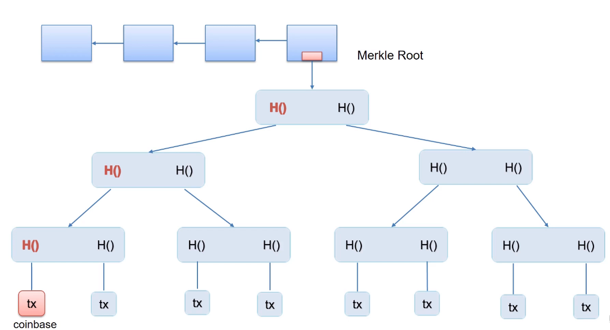
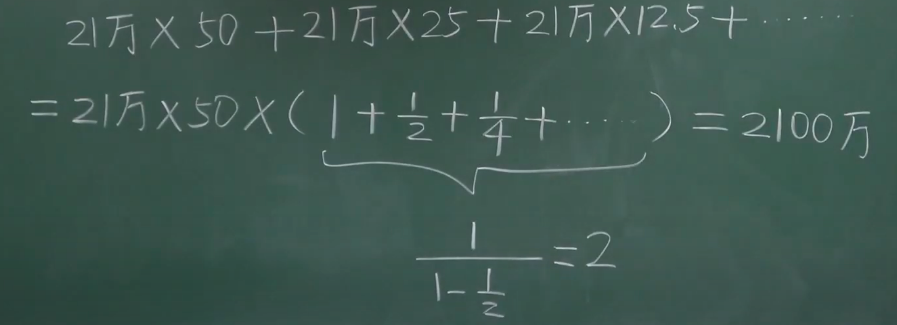
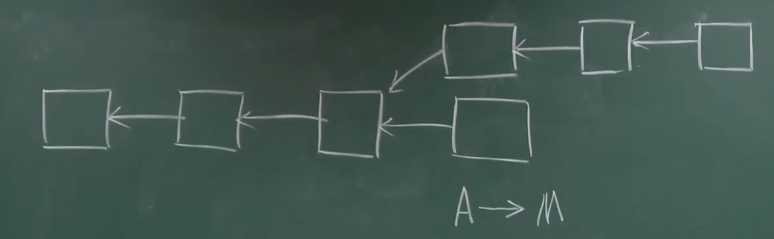
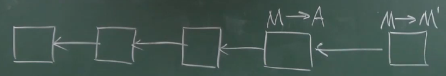
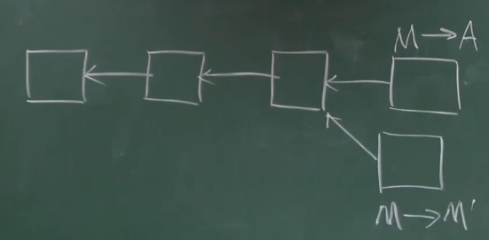
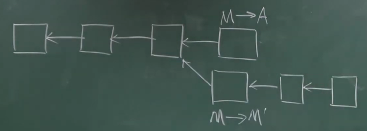
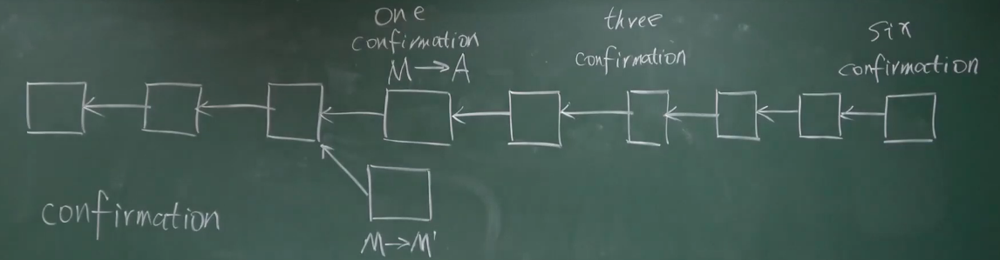
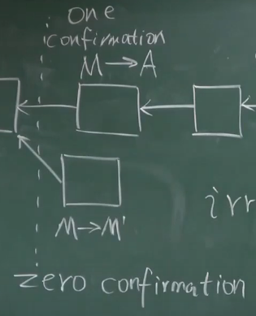
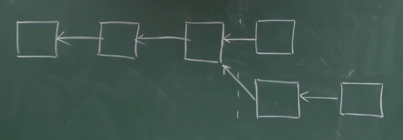

# 05-BTC实现

### Transaction-Based Ledger

比特币中的交易需要说明币的来源。

#### UTXO

Unspent Transaction Output - 还没有被花掉的交易的输出

- 产生这个交易的哈希值
- 在这个交易里面是第几个输出

为了检测双花问题，想花的币必须要在这个集合中才是合法的，需要全节点维护这样一个数据结构。

每个交易会消耗一些输出，也会产生一些新的输出。

**中本聪**不花比特币，永久的保存在UTXO中的。

#### Total Inputs == Total Outputs

一个交易可能有多个输入输出，所以需要有多个签名。

有些交易总输入会**略**大于总输出，差额作为手续费给记账权的那个节点。

初块奖励 + 打包交易获得手续费（交易费 transaction fee）

初块奖励每隔21万块就减半，平均出块时间是10min，相当于**4年**的时间减半一次。

### Account-Based Ledger

 以太坊：系统显示记录每个账户拥有多少个币。

---

### Extra Nonce

增大搜索空间到96位

- 外层循环调整Extra Nonce

- 内层循环调整Header里面的Nonce

### 脚本配对

输入脚本和提供币的输出脚本进行配对，如果能拼接在一起正确执行，就🆗啦。

### 挖矿的过程进行概率分析

**Bernoulli Trial:** a random experiment with binary outcome.

最简单的例子：抛硬币。

**Bernoulli Process:** a sequence of independent Bernoulli Trials.

- Memoryless

**Poisson Process:** 因为实验的次数很多，成功的概率很小，所以可以使用泊松过程来近似。

**出块时间：**服从指数分布 - exponential distribution

整个系统平均的出块时间是10min，通过定期调整挖矿难度来平衡。

而对于单个矿工而言，他的出块时间（统计上的概念）取决于他的算力占总算力的百分比。

e.g. 无记忆性的应用：

- 从任何位置切割开都是相同的指数分布曲线
- 所以如果已经等了10min没有产生区块，但是下一个区块产生的时间还是期望10min

- **Progress Free: **成果和过去的工作无关。
- 虽然无情，但是是挖矿公平性的保证。

### 比特币的总量

**Geometric series**

比特币求解只是比拼算力，难度增加（稀缺性）是人为造成的。

**BitCoin is secured by mining.**

对于一个去中心化的货币来说，只要诚实的节点掌握大多数的节点就可以维护比特币的稳定。

### 安全性的分析

保证写入区块链的交易都是合法的 ❌

记账权有可能被恶意节点掌握：

- 把别人的钱转给自己❌

  因为没有办法伪造别人的签名（需要别人的私钥）

  如果硬写到区块链中了，诚实的节点不承认，就走了另外的链路

  

  对于恶意的节点来说，不仅没有偷到钱，还白白损失了初块奖励。

- 把已经花的币再花一遍

  - 直接连在后面是肯定不行的 - 明显的双花问题

    

  - 分叉攻击（在开始挖矿的时候就要提前准备）

    

    形成了两个等长的合法链，之后继续操作。

    M->A的时候，M处理一个不可逆的操作；然后M->M'，将之前的交易回滚，就可以获利了。

    

    既得到了商品，又把钱收回来了。

    

    恶意的节点需要不断获得记账权才有可能回滚交易。

    One Confirmation / Two Confirmation ... 比特币默认等待6个Confirmation

**Zero Confirmation**

区块链默认谁先开始广播就先承认谁 

商品发货有一个延时，缓冲时间

**恶意的节点获得记账权**

恶意的节点可以不把一些合法的交易写进去

**Selfish Mining**

正常人挖到区块就抢先发布出去。

我自己藏着一条链，需要我计算能力相当强。

**减少了竞争：**别人用全部精力挖上面链的块，下面的链可以独自挖下面的链。

