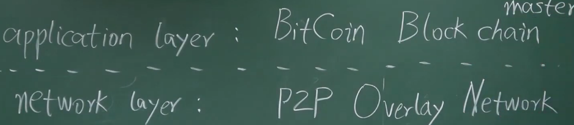

# 06-BTC网络

比特币的设计原则是：简单、鲁棒，而不是高效

**Simple, Robust, but not inefficient.**

消息是使用 flooding 的方式：

- 节点第一次听到消息的时候，传播给所有的邻居节点，同时记录一下这个消息已经收到过了
- 邻居节点的选取是随机的，并没有考虑底层的拓扑结构（增强鲁棒性）

转发的前提是合法的：没有被花过，有正确的签名等。。。

一个节点传播具有延时，不一定所有的节点都能收到。

