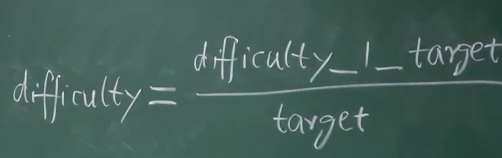
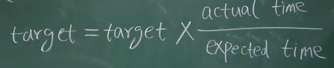

# 07-BTC挖矿难度

Blcok Header里面的Nonce值，使得计算出来的哈希值小于目标阈值。
$$
H(block header) \le target
$$
比特币使用的算法是 SHA-256 ，256位的哈希值，取值空间是$2^{256}$。

调整难度实际上就是调整目标阈值的空间占总空间的比例。

**挖矿难度和目标阈值是成反比的。**

挖矿难度最小就是1，对应的目标域值是一个非常大的数。

因为总算力的增强，挖矿难度需要逐渐增加，使得平均出块时间维持差不多。

**初块时间 -> 交易写入区块链的时间**

### 出块时间太短的问题

出块0.1秒，底层可能需要几十秒才能传播到大部分的节点。但是在这个过程中也在不断地产出区块，这样就容易产生分叉。

如果时间太短，分叉成为常态，就会引起多分叉。

也容易产生更容易攻击的情况。

### 改成其他的数字

改成5min, 8min也是可以的。

以太坊出块速度是 15s，需要设计一个新的共识协议——**Ghost**：

分叉产生的Orphan Block不能简单地被丢弃掉，需要一些奖励——Uncle Reward

同时需要改变难度，来维持出块速度的稳定，不能无限制地减少下去。

### 调整阈值

每隔2016块，大约两个星期调整一下。

左侧的Target是新的Target（目标阈值-实际代码中使用）

实际代码中都有4倍的限制（如果超过到了8个星期）还是按照8个星期来计算。

### 同时调整目标域值

计算target的代码，是写在比特币的代码里面，会自动进行调整target。

以太坊会更加复杂一点，每个区块都有可能进行调整。

