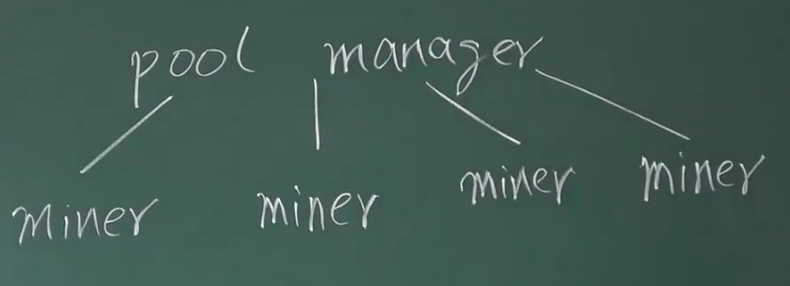

# 08-BTC挖矿

### 节点

#### 全节点

- 一直在线
- 本地硬盘上维护完整的区块链信息
- 内存中维护UTXO集合，一遍快速检验交易的正确性
- 监听比特币网络上的交易信息，检验每个交易的合法性
- 决定哪些交易会被打包到区块里
- 监听别的矿工挖出来的区块，验证合法性

#### 轻节点

- 不是一直在线
- 不用保存整个区块链，只要保存每个区块的块头（差了1000倍）
- 不用保存全部交易，只保存与自己相关的交易
- 无法检验大多数交易的合法性，只能检验与自己相关的哪些交易的合法性
- 无法检验网上发布的区块的正确性
- 可以验证挖矿的难度
- 只能检测哪个是最长链，不知道哪个是最长合法链

#### 比特币的安全性

密码学上的保证：没有私钥，就不能伪造签名，就不能转走你账户的钱。（前提是系统中大多数算力的用户是遵守协议的）

### 挖矿

挖矿中最重要的计算就是计算哈希。

最开始使用CPU挖矿，第二代使用GPU（通用并行计算，用于浮点数计算的部件就被浪费了，挖矿只需要整数的计算），第三代使用ASIC芯片来进行挖矿。

**ASIC: **Application Specific Integrated Circuit

**Mining Puzzle: **一种ASIC只能挖一种币。

**Alternative Mining Puzzle: **抗ASIC

对于整个矿池的算池来说，出块的时间是10min；但是对于一个矿机来说，就很长时间了。

### 矿池

解决收入不稳定的问题：

- 物理连接
- 分布式：矿池和机器连接，之后按照工作量来分红

矿工需要找到一个 Nonce，用这个 Nonce 计算 Block Header 里面的哈希值。

**降低难度：**

**Share - Almost Valid Block**

- 假设原来需要前面70位是0的
- 降低难度，让小矿工挖到60位是0就可以了，然后将 share 提交给矿主
- 这个只能用来作为小矿工的工作量证明，除此之外没别的用处
- 降低了难度，“收益” 就是稳定的了

> 某个小矿工挖到一个区块之后，不提交给矿主，直接偷偷发出去呢？

- 每个矿工的任务是由矿主来分配任务的。
- 除了Nonce，还有需要调整的参数
- CoinBase Transaction 里面填的的是矿主的地址

> 捣乱，丢弃真正的结果，有没有可能呢？

有可能，出现损人不利己的情况；也有可能是间谍。

###  分叉攻击

**51%攻击 **- 等6个区块

**封锁交易** - 越早越好，直接处理

