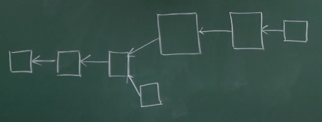
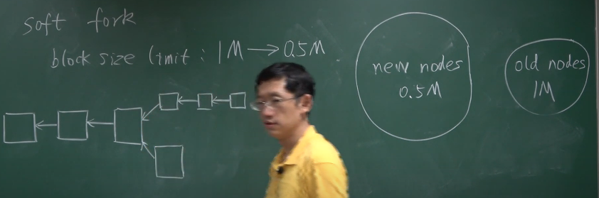
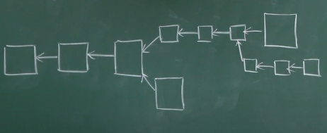

# 10-BTC分叉

**State fork**状态分叉

**Protocol fork**协议分叉：使用不同版本的协议

根据协议修改的不同：

- Hard Fork
- Soft Fork

### Hard Fork

新协议对比特币添加一些新特性，新功能。

没有升级的旧节点不认可新的协议，就形成了硬分叉。

#### Block Size 变大

交易需要被等到下一个区块才能被写入（10min）

1 MB -> 4 MB（大多数节点更新了）

旧节点产生的区块，新节点（1M<4M）是认可的。

- 大多数新节点会继续挖；——最长合法链（因为大多数）
- 少数旧节点分叉继续挖。

分叉是因为大多数节点认可4M去挖。

上下两条链会继续发展（初块奖励存在），社区分裂了。

**真实案例：**ETH/ETC

两个只有协议不一样，但是账户、密钥都是一样的。

ETH上面的交易，在ETC上面回放。

最后加了一个Chain_ID。

### Soft Fork

对比特币协议加一些限制，原来合法的区块变得不合法了。

#### Blcok Size变小

1M->0.5M（大多数结点开始挖小区块）

去中心化的系统，改变一个参数就有可能产生分叉。

- 新节点只认上面的链，新节点认为下面的是不合法的
- 旧节点两个都认（<1M）

上面的链变成最长合法链之后，就全部迁移到上面了。

这个分叉是临时性的，因为自己（旧节点）自己就放弃了。

系统不会有永久性的分叉。

####  实际情况

- 给没有规定的域赋予新的规则

  coinbase 域 

  - extra nonce：挖矿难度
  - UTXO的根哈希值 

- P2SH：Pay to Script Hash

  最开始的比特币的版本没有，是通过软分叉添加进去的。

  **redeem Script**

### 整理一下区别

硬分叉：新节点认旧节点的区块，但是**旧节点不认新结点生成的区块**。

- 只有所有的节点都更新了，才不会出现永久性分叉。
- 理解：旧的不认新的，只能都更新了才行。

软分叉：旧节点认新节点生成的区块，新节点不认旧节点生成的区块。

- 半数算力以上的节点更新了，就不会出现永久性分叉。
- 理解：新的不认旧的，没有事儿，可以正常发展。通过算力让它只是临时分叉。

