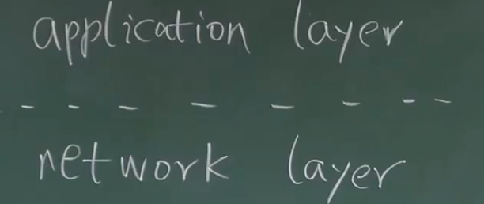
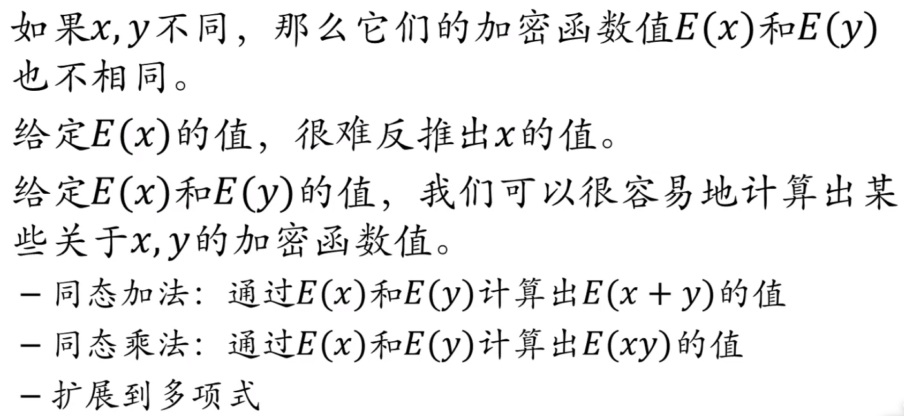

# 12-BTC匿名性

pseudonymity - 假的匿名

现金是完全匿名的，没有任何的标识。

如果银行允许使用化名，隐私性比比特币更好。

比特币的账本是完全公开的。

---

比特币什么情况会破坏匿名性：

- 创造的地址可以关联在一起
- 交易：允许多个输入和输出
- 交易的输入：控制了多个私钥，有可能是同一个人
- 输出地址中有一个是找零钱的地址
- 输入地址输出地址的关联
- 人为产生不相关的交易
- 比特币也有可能和线下人产生关联 - 资金的转入和转出

- 实体世界中使用比特币支付的时候
  - 延迟很大
  - 交易费很贵
  - 隐私泄露

---

证明 公开信用卡数据反推信用卡主的身份：过滤几次后就发现可以定位到人了。

**silk road** 使用洋葱路由 + 比特币 -> 被发现了。

**互联网不是法外之地。**

---

**你不想向谁暴露身份？**

尽可能提高匿名性

ip 地址和现实生活中有很强的关联性。

多路径转发 - （洋葱路由） - 很多跳 - 只知道上一个节点是谁 - **网络层**

**应用层** 

比特币能找到最开始的源头

**coin mixing 把很多人的币混杂在一起 - 收取一定的服务费**

- 投入的币容易被卷款跑路了

- 法律是鞭长莫及的

- 在线钱包：存进去的币和取出来的币(来源不同)

- 交易所：交易的时候自然就带上了交换币的情况

比特币是完全公开透明的

---

# 零知识证明

证明者向验证者证明一个陈述是正确的，而无需透露 除该陈述是正确的 以外任何信息。

e.g. 签名：不向你泄露我的私钥，但是我透露了签名。

### 同态隐藏

1. 加密函数值不会出现碰撞（逆否命题：加密的值相等，两个原来的数是相等的）
2. 很难从加密的值反推出加密前的值
3. 同态加法+同态乘法 -》 扩展到多项式。

### 例子

Alice 想要向 Bob 证明她知道一组 x,y 使得 x+y = 7 怎么告诉呢？

##### 简单的版本

- Alice 告诉 Bob E(x) E(y)
- Bob 通过获得的 E(x) E(y) 计算出 E(x+y)
- 同时计算出了 E(7) 的值

就可以判断验证通过或者验证失败了。

##### 盲签方法

- 用户 A 提供 序列号，银行在不知道 序列号 的情况下，返回签名，减少 A 的存款。
- 用户 A 把序列号 和 签名 都交给 B 完成交易
- B 把 序列号 和 签名交给银行验证，银行验证通过，增加 B 的存款。
- 银行无法把 A 和 B 联系起来
- 中心化

---

### 零币和零钞

协议层就融合了匿名化处理，匿名性来源于密码学的保证。

- 并非主流
- 有这个需求的用户也不是很多
- 数学原理上提供了很高的匿名性，但是也不一定是百分百安全的
- 并没有解决和现实生活中交互的过程中