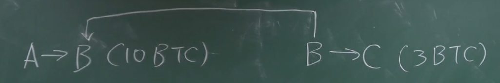
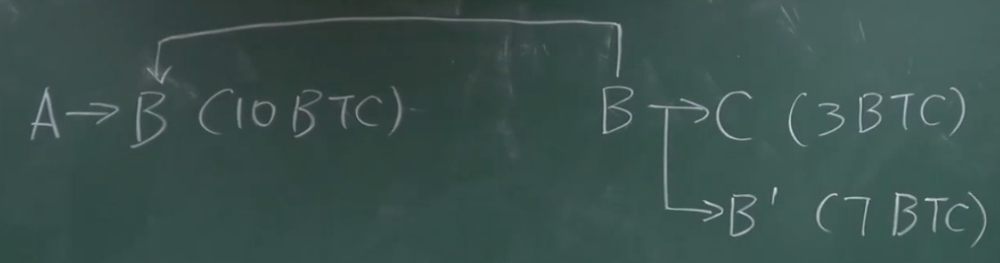
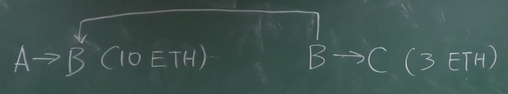
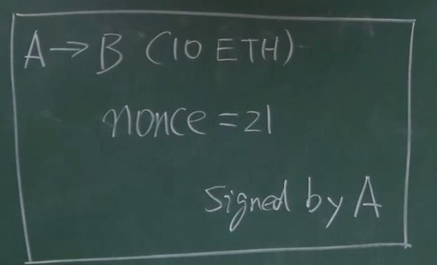

# 15-ETH账户

**比特币** - 基于交易的系统

系统中没有直接记录一个用户有多少币 - 通过 UTXO 里面求和可以计算

剩下的比特币变成了 交易费

剩下的转回自己。 

**以太坊** - 基于账户的交易系统

Account-based ledger

系统中显示的记录有多少个以太币。

剩下的币就可以直接放在账户里面。

同时也不用说明币的来源了。

---

比特币中 double-spending

以太坊中不关心来源，花出去余额就会减少。

**缺点：**

- 篡改自己账户上面的余额 - 防范了 👇
- 你的余额 - 全节点中保存账户的余额（没有办法篡改，需要改所有的全节点）

- **replay attack** 重放攻击：又重新广播了一便，就又一次扣款了。

增加一个 nonce 计数器（交易内容的一部分），并且有签名的保护

全节点需要维系 **余额和nonce**。

---

### 外部账户 - 普通账户

公私钥产生 + 余额  + nonce

### 合约账户 - Smart Contract Account

合约账户不能主动发起交易。

Code

Storage - 相关的状态

给你一个合约的地址，调用合约账户

**为什么设置这种？**

**Vitalik** - 创始人

区块链 - 匿名性 - 重视隐私保护

以太坊要支持智能合约，比较稳定的身份。

要通过智能合约推出一些金融衍生品。

