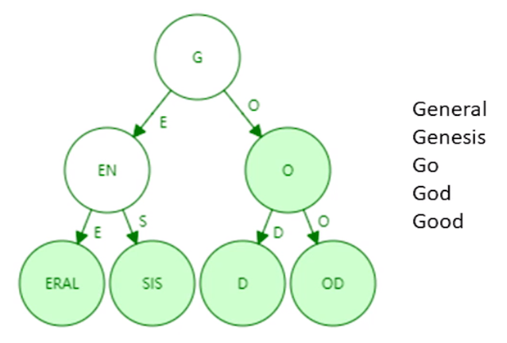
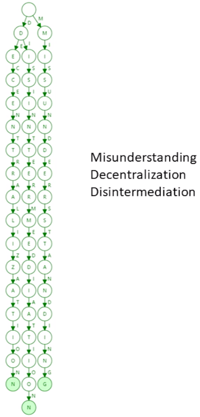
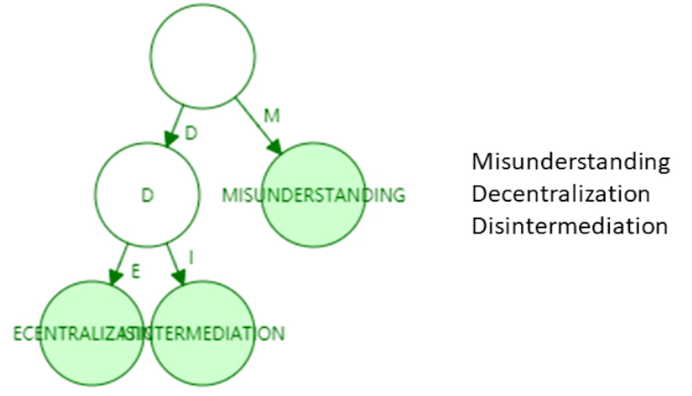
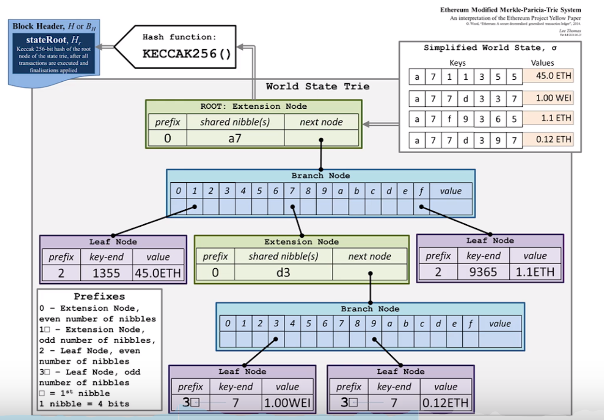
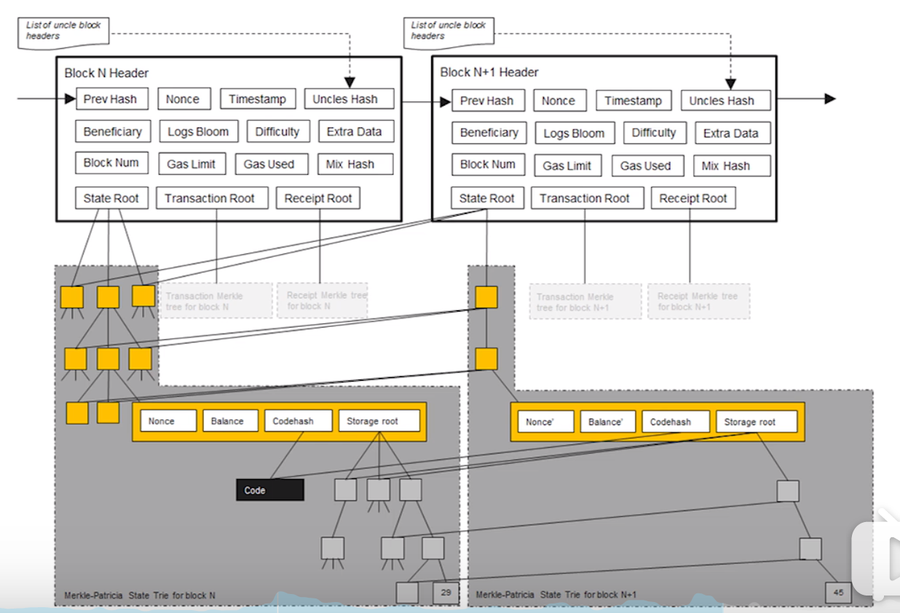
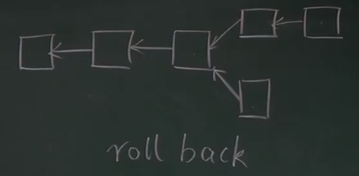
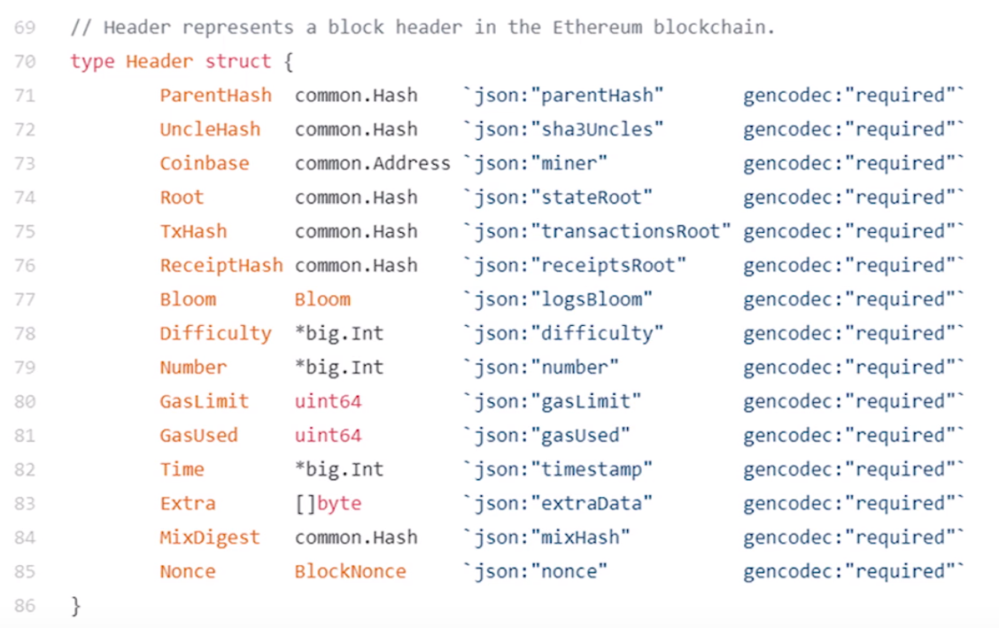
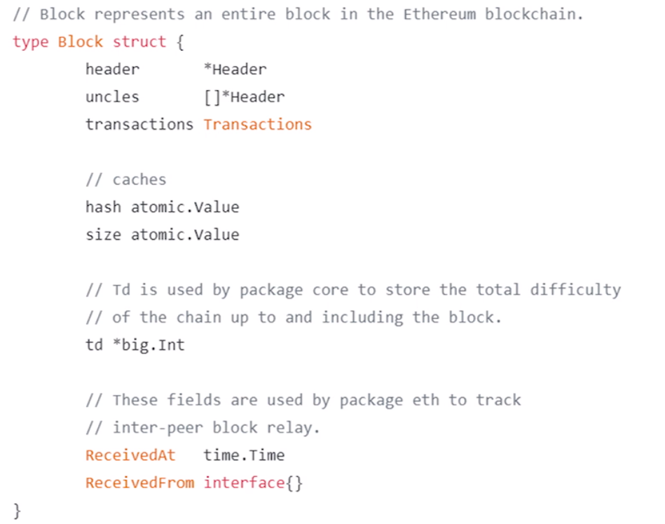
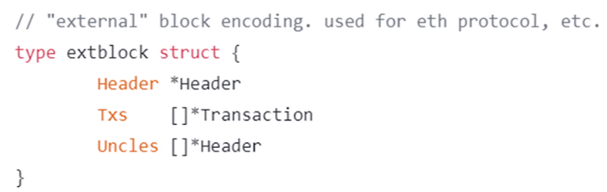

# 16-ETH状态树

addr - > state

账户：160 bits -> 40 个 16 进制的数

状态：上节课说的两类账户里面的具体信息

**<key, value> 哈希表**来实现 - 更新和查询都很容易

- 如果需要提供 Merkle Proof 怎么提供？
- 组织成一个 Merkle Tree -》 根哈希

**如果组织起来了**，但是有少部分节点发生了变化，但是对于整体会产生巨大的改变。

比特币中构建的 Merkle Tree 只是存储 区块 中存储的交易。

**Merkle Tree** 没有一种高效的查询和更新方法。

**要不要排序 - Sorted Merkle Tree**  - 如果不排序 MT 不是唯一的

比特币最后是 **获得记账权的节点** 说了算。所以虽然会有不同的顺序，但是只有唯一的一个顺序。

**sorted Merkle Tree** 排序的代价也很大，重新排序也有很大代价

### MPT 数据结构

Trie 字典树 - 前缀树

- 每个节点的分支数目- 最多27个（26字母 + 再加上一个结束位）
- Branching Factor（16进制 + 1个结束位）
- 查找访问的次数：取决于查找单词的长度（最长 40 位）
- 比特币和以太坊中的地址不可以交互使用
- 以太坊中的地址也是 公钥经过转换（取哈希然后截断）
- Trie不会出现碰撞 - 只要地址不一样 - 就不会发生碰撞

- 和插入顺序无关
- 更新相关：系统中绝大多数的结点是不变的

缺点：

- 浪费存储的空间 / 查找效率有点低：因为树太高了

**Patricia Tree** - 压缩前缀树

进行路径压缩，极大的减少了树的高度（细节有一点小错误）

新插入一个单词，原来的路径有可能扩展开来。

树中路径如果是比较稀疏，路径压缩的作用就很明显。

总结：比较稀疏的时候比较好

为什么要这么多位数：

- 减少碰撞
- 更加安全

---

### Merkle Patricia Tree

区块链和链表的区别：把普通指针换成了哈希指针

以太坊中也有交易树

现在说的是状态树的根哈希值：

- 防止篡改
- Merkle Proof - 证明你有多少钱（账户的信息）

- 证明某个值在里面不存在

假设只有 7 位的地址，只是显示余额。

虽然两个树都有节点，但是有很多节点都是共享的，只有改变的被标注出来。

每次出现一个区块，都要创建一个 MPT

为什么要保留历史状态：因为头节点的哈希值就会改变

系统中有可能出现分叉- 出块时间降低到 10 s

假设有一个分叉，出现回滚，我们就需要之前的历史记录。

比特币直接放弃短链，或者推算出迁移1个状态。

简单的转账交易回滚是比较容易的。

但是以太坊中有智能合约（图灵完备的）不能反向推算回原来的状态。

### 节点的结构

- ParentHash 区块哈希值
- UncleHash 
- Coinbase 矿工的地址
- Root 状态树的哈希值
- TxHash 交易树的哈希值
- ReceiptHash 收据树的哈希值

### 区块的结构

(key,value) pair

序列化的过程 Recursive Length Profix 极简主义

**protocal buffer -> protobuf** 序列化的一个库

只支持一种数据类型 nested array of bytes