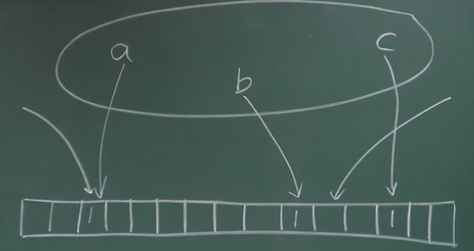

# 17-ETH交易树和收据树

交易树 - 和比特币中的 MT 是类似的。

收据树 - 每个交易执行完会形成一个收据，记录交易的相关信息。

收据树（智能合约执行过程比较复杂）更好理解过程。

---

### 都是 MPT

以太坊的树使用相同的类似结构可以更加简洁。

支持查找的操作，可以从上往下查找。

排列的顺序由发布交易的节点来决定。

**状态树** - 》 包含所有节点，无论是不是发生了改变。沿用之前的节点。

**交易树 和 收据树** 是独立的，不用共享节点。

### 作用

1. 提供 Merkle Proof
2. 支持更加复杂的查询操作
   1. 过去十天所有跟某个智能合约相关的交易
   2. 过去十天中所有的众筹事件 / 发行新币的事件

### Bloom Filter

支持高效查找某个元素是不是在这个集合中。

有可能出现 False Positive，但是不会出现漏报。

**从集合中删除一个元素**

不能直接改成 0 ，集合中有可能直接映射到这个位置。

一般不支持删除操作。

---

### 收据

块头里面的 bloom filter 有没有我们想要的交易

轻节点只有块头的区块

---

### 交易驱动的状态机

transaction-driven state machine

比特币中的状态是 UTXO

---

收款人的地址从来都没有听过 - 创建的时候不用通知别人

状态树 / 交易树 / 收据树 - 只包含部分节点的状态信息：

- 每个区块没有一个完整的状态树

- 最近一个区块有可能没法知道账户的最近的状态

- 新建一个节点 - 找到创世纪块（问题所在

