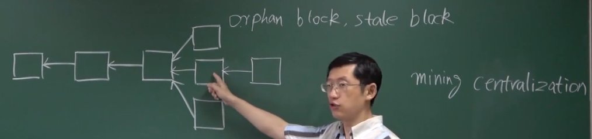
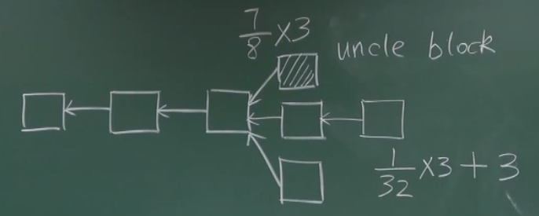
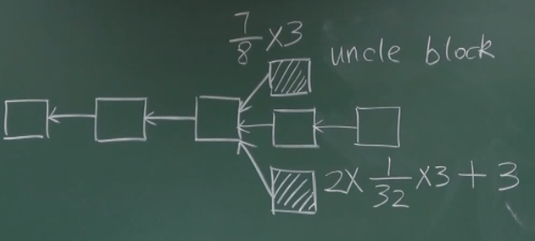
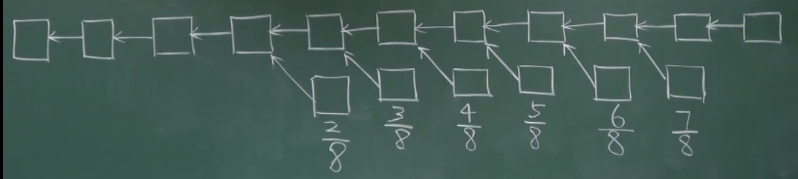
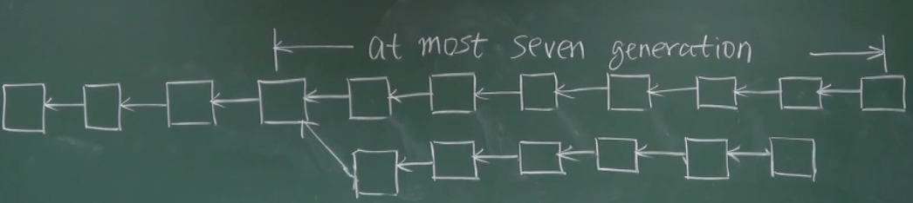
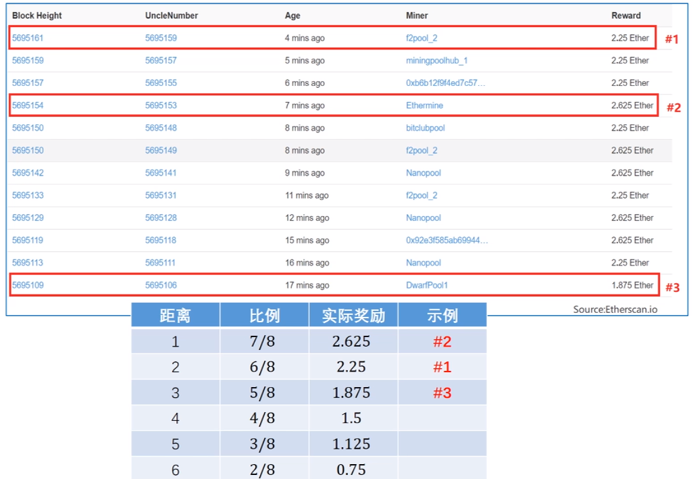
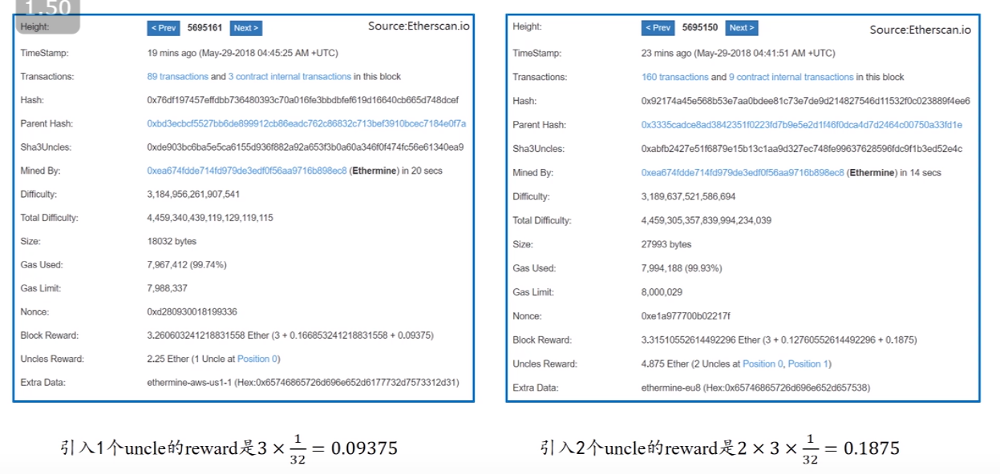

# 18-ETH-GHOST

新发布的区块传播到网上的其他节点。

以太坊中会有很多临时性的分叉。

**比特币** - 只有在最长合法链上面的区块才是有用的。

挖出来的区块，有可能就作废了：

- 挖矿设备的专业化
- 大型矿池的出现 - Mining Pool

共识协议的设置就很重要了 - 为了保护个体矿工。

挖到矿的概率 和 挖成最长合法链 的概率是不一样的。

Centralization Bias

### GHOST

挖出来区块作废了，依然能够得到一些出块奖励。

比特币中叫： Orphan Block

以太坊中叫： Uncle Block

如果包括上下两个 Uncle 结果还可以乘以 2：

鼓励系统中出现了分叉，及时进行合并。

- **只能包含两个 Uncle Block**

- **不让别人得到区块奖励** - 竞争关系

以太坊中即使是爷爷辈，但是没有关系啦。但是只能有 **6** 个区块。

**At most 7 generation**

- 为了避免疯狂的挖之前难度的区块。

- 避免全节点中维系太多的无用区块。

- 鼓励今早进行合并。

**Uncle Reward** - 递减

**当前区块奖励** - 固定的 1/32

目前都是临时的 state fork

---

叔叔的区块被包含进来的时候没有 交易费，只有出块奖励部分的奖励。

叔叔区块的交易并没有被执行。有可能叔叔和父亲的交易是有冲突的。

**只检查** 叔叔区块 是不是一个 符合挖矿难度的区块。

---

叔叔区块之后还跟着一串

不鼓励这样的机制 - 各干各的；应该鼓励将计算量集中到主链上。

FORKING ATTACK 变得太便宜了：交易成了攻击成功 - 交易失败也能得到奖励 ❌

所以规定只有第一个 Uncle 才能得到出块奖励。

**Etherscan**

