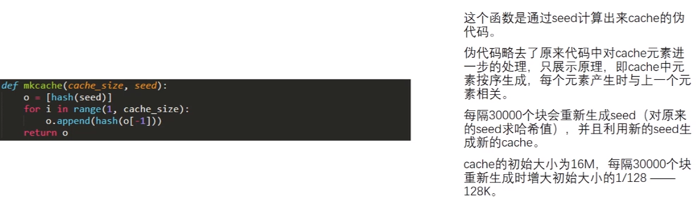
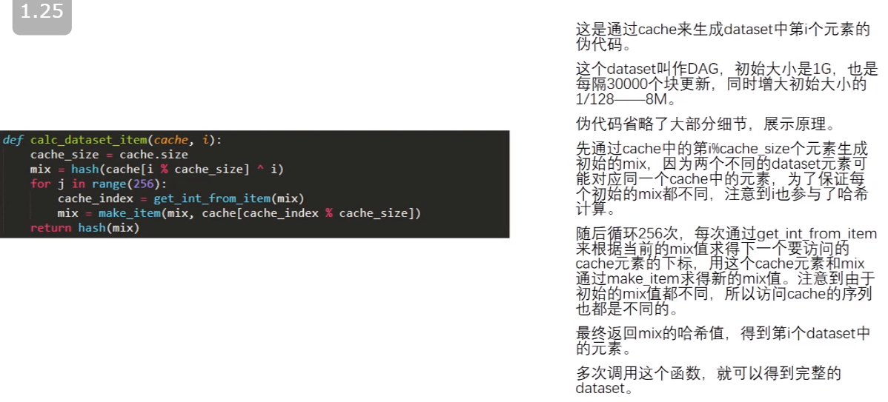
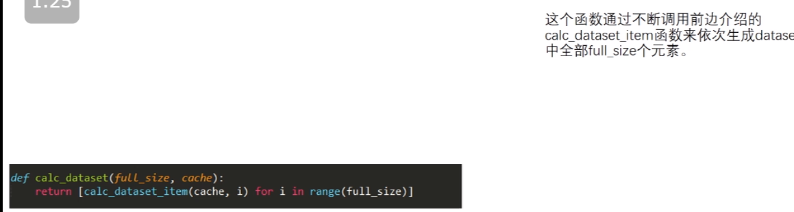
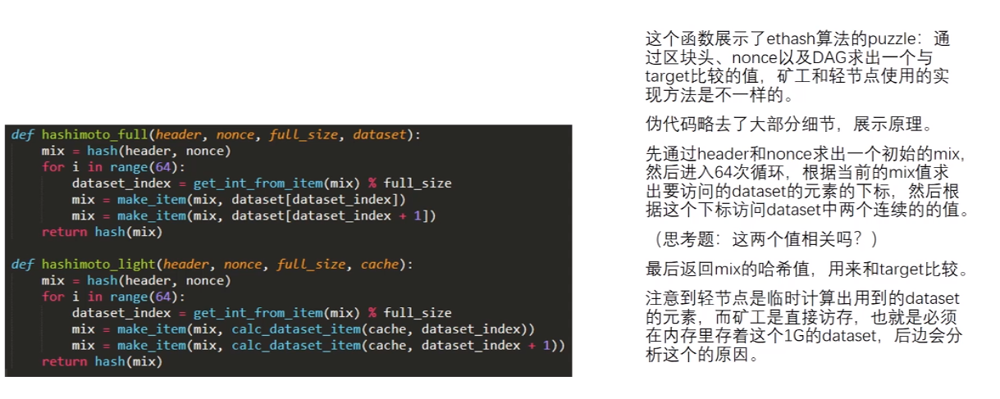
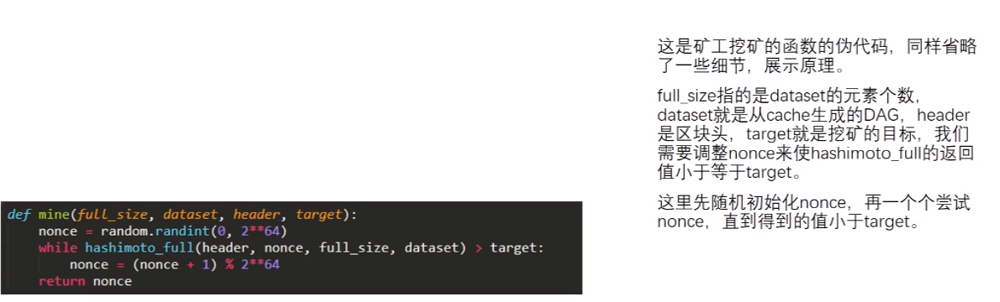
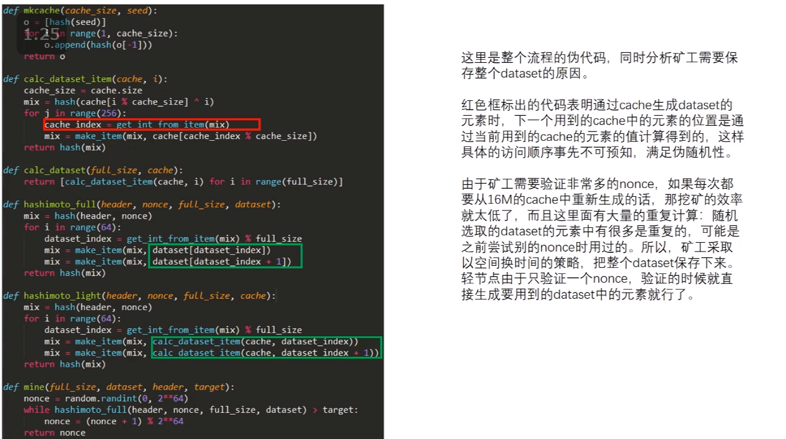
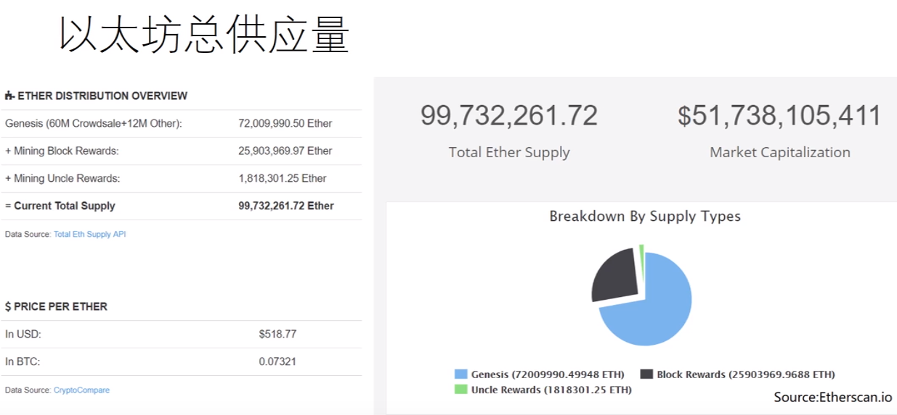

# 19-ETH挖矿算法	

Bug Bounty 的赏金

比特币天然就是一个 Bug Bounty.

挖矿设备的专业化 - 只能用专业的设备来挖矿 - 和比特币设计的初衷是违背的：

> One Cpu, One Vote.

现在新设计的 Mining Puzzle 都是为了 ASIC Resistance：

——增加内存的访问 - LiteCoin - Scrypt

### LiteCoin

开设一个很大的数组，按照顺序填充一些伪随机数

- seed 产生第一个数，后面的值是前面的值取哈希得到的。
- 伪随机的顺序去读取一些数

- 需要保存一个内存区域
  - 只保存奇数位置的数组

- 任务更像一个普通计算机做的来处理的

好的地方是：Memory Hard

坏的地方：对于轻节点来说也是 Memory Hard

- Difficult to solve; Easy to verify

实际使用的时候设置只是 128 KB - 太小了（对于 ASIC 芯片也容易啦~）

出块速度是比特币的 4 倍。

---

### 冷启动问题

最开始的时候没有知名度，需要人来。

同时基于工作量的证明的货币，最开始的时候容易不安全 - 51%的攻击。

---

### 以太坊

两个数据集：

- 小的是 16M cache - 轻节点
- 大的是 1G Dataset DAG - 矿工保存

生成方式和 LIte 币一样，使用方式不同：

小的 cache 和 大的 Dataset 也是一直增长的。

在 cache 里面运转 256 次，然后放在 Dataset 里面。

求解 Puzzle 时候使用大数据集 读取 128 个数 - 64轮循环 每次两个数

### 伪代码

1. cache 生成 64 位

   

2. dataset 生成 - 通过 cache 来生成大数据集中的第 i 个元素

   

3. 生成每一个元素

   

4. 矿工用于挖矿的函数 + 轻节点用于验证的元素

   

   **挖矿** 只用到块头的信息 - 轻节点只下载块头

   - 块头信息 + nonce 计算出一个初始的 mix
   - 每次读取两个相邻的位置
   - 更新当前的哈希值 mix

   两个连续的哈希值 - 没有什么关系

   **轻节点** 不挖矿，第一个参数是块头的 header， 验证 nonce 是不是符合要求。

5. 矿工挖矿的主循环：

   

   尝试不同的 nonce 来不断的挖矿。

**所有的汇总**

---

### 工作量证明转向权益证明

**以太坊没有 ASIC 矿机**

权益证明 - 不挖矿 - 类似股份制公司来投票

pre-mining: 预挖矿的过程 - 预留一部分给加密货币的开发者

pre-sale: 预先获得，然后卖了，得到资金然后用于加密货币的发展。

### 统计数据

大多数都是创世区块哦

