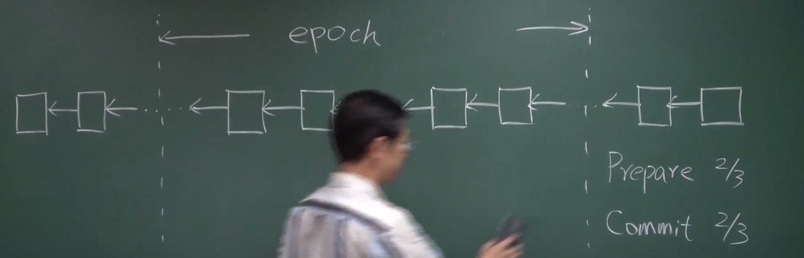
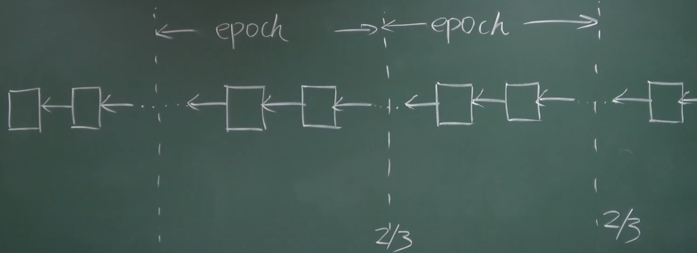

# 21-ETH权益证明

Proof of Stake

比特币 - 传统的方式浪费电 - 一个交易相当于 1000 度电——智利

以太坊 - 相当于冰岛的能源消耗。

---

### 为什么要挖矿？

参与记账 - 得到奖励

### 怎么获得收益？

挖到区块 <- 算力占比 <-买设备 <- **投入资金** （根源在这儿）

现在是有钱去买矿机，然后去挖。为什么不直接投入区块链的建设呢？最后按比例来分红。

---

### Virtual Mining

预留一部分货币给开发者；预先卖出去一部分供开发的资金。

最后是按照 **持有的币的数量** 来投票的

优点：

-  **省电**

- 维护安全的闭环——发动攻击的人可以从外界获得攻击的能力

  需要获得一半以上的币才行，是一个闭环

拥有的币越多，获得新的币的难度越小——弊端

要求锁定一段时间）—— Proof of Deposit

---

### 两边下注 - Nothing at stake

基于权益证明 —— 两边都下注

因为没有什么损失（如果下面没有被确定的话。

---

### Casper the Friendly Finality Gadget(FFG)

Validator 推动得到共识 - 投票取决于保证金的大小

Two-phase Commit

- Prepare Message 2/3
- Commit Message 2/3

实际情况中，使用 50 作为 epoch，然后只是用一个 Commit

- 对于前一个区块来说是 Commit Message
- 对于后一个区块来说是 Prepare Message

**原始的版本**

**优化了之后**

验证者参与这个过程，能够得到奖励；不良行为，引起惩罚：

- 不投票，引起迟迟不能达成共识：惩罚部分保证金
- 两边都投票：没收全部保证金

没收的保证金就直接被销毁了。

验证者也有任期，等待期。

---

### Check Point 是不是绝对安全的？

Finality - 这里面的交易是不会被推翻的？  - 是不是绝对的？

这个是验证者投票投出来的，不会被推翻。

攻击成功 - 一定是大量验证者双边投票。

---

### 权益证明

权益证明不是很成熟 - 暂时还没有经过时间的检验

**EOS** 使用 DPOS 协议：投票的方式选出来21个超级节点，然后再选出来区块。

---

比特币的工作量证明是 一种转换电能到钱的方式。

