# 22-ETH智能合约

智能合约是运行在区块链上面的一段代码， 代码的逻辑定义了合约的内容。

账户里面保存的是合约当前的运行状态：

- balance - 当前余额
- nonce - 交易次数
- code - 合约代码
- storage - 存储，数据结构是一个 MPT

Solidity 是常用语言，和 JavaScript 类似

---

### Solidity

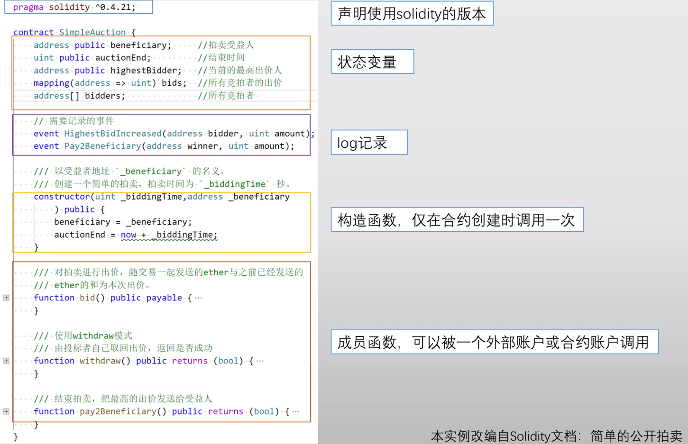

转账交易实际上是对智能合约的一个调用。

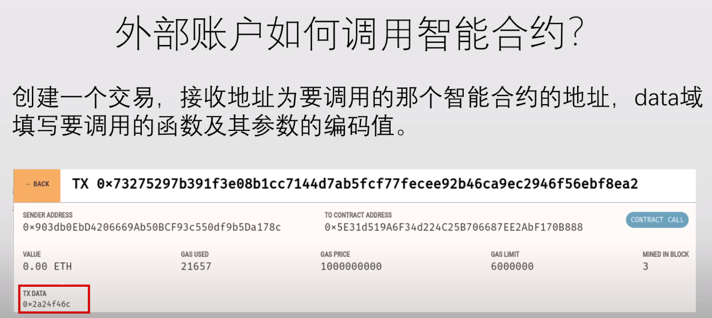

一个合约也可以调用另一个合约

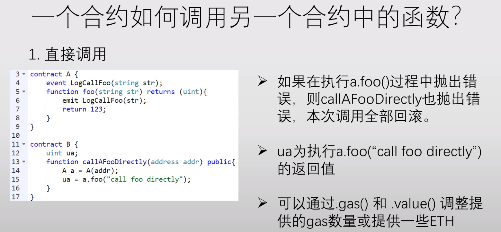

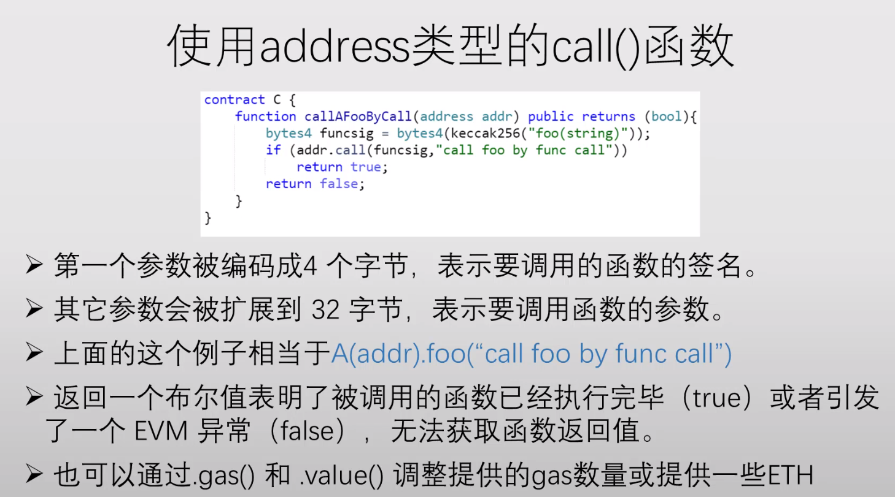

---

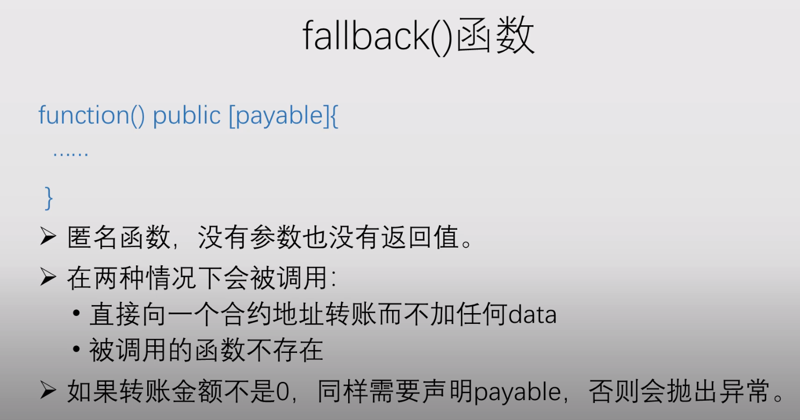

匿名函数，没有参数也没有返回值。

缺省调用这个 fallback() 函数。

---

**Halting Problem** - 本质上是不可以解的。

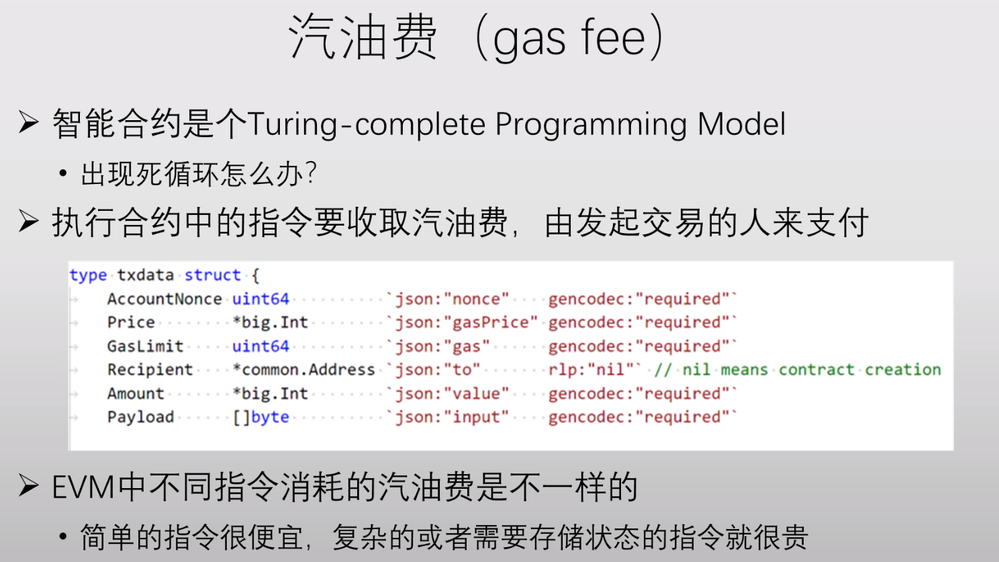

**错误处理**

交易具有原子性质。

错误的状态会引起回滚，但是已经产生的汽油费是不退的。

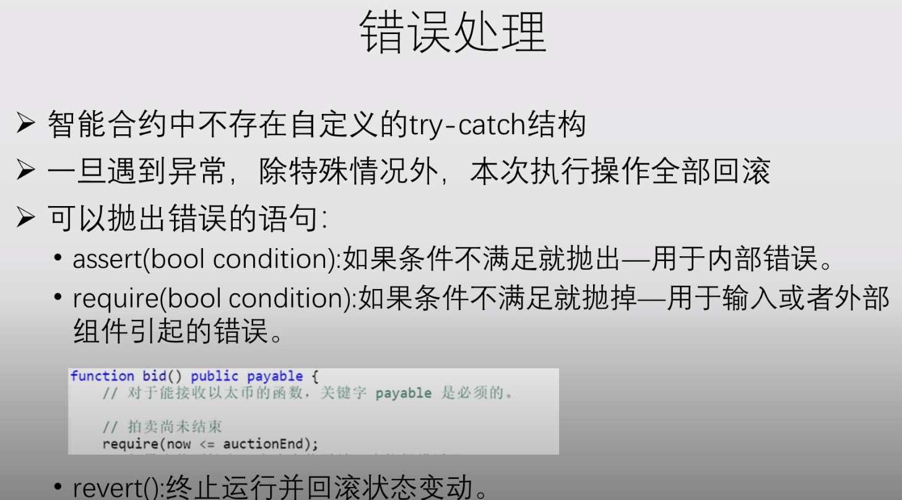

---

Gas Used: 所有用的 Gas

Gas Limited: 限制 Limit，不能太多交易。（可以微调 1024分之一）

区块链中有一笔交易要是想执行的话，需要所有的节点在本地执行一下。

**汽油费是如何扣的？**

多个全节点在本地的账本上扣一下。

都是本地的修改，只有挖到矿了，发布出去了，才会变成真正的共识。

先执行完交易，然后才能知道三棵树，才能知道树的根哈希值，然后才能尝试 nonce

**必须先执行，然后再挖矿**

如果被人抢先了，我能得到什么补偿？

- 汽油费 没有
- 努力成为叔父区块 也没啥用，最后都要切换到最长合法链
- 以太坊中没有任何补偿，还要执行一遍（免费）

这种机制下，对于算力小的矿工很难受。

智能合约支持并行处理吗？

多个核一起来执行，有可能结果是不一样的。

---

智能合约可以获得的区块的信息

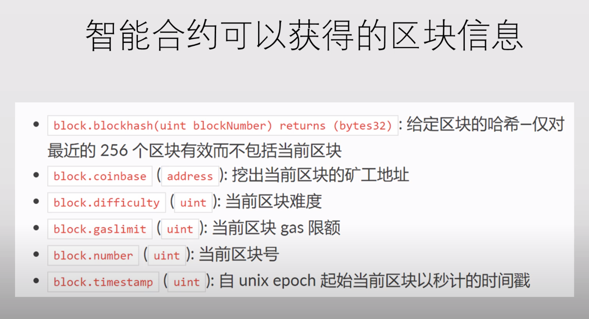

智能合约可以获得的调用的信息：

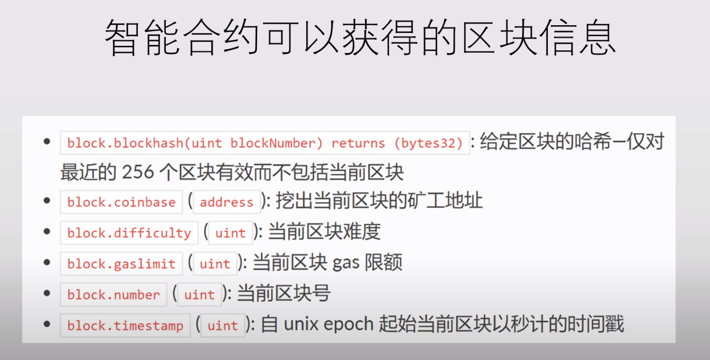

地址类型：

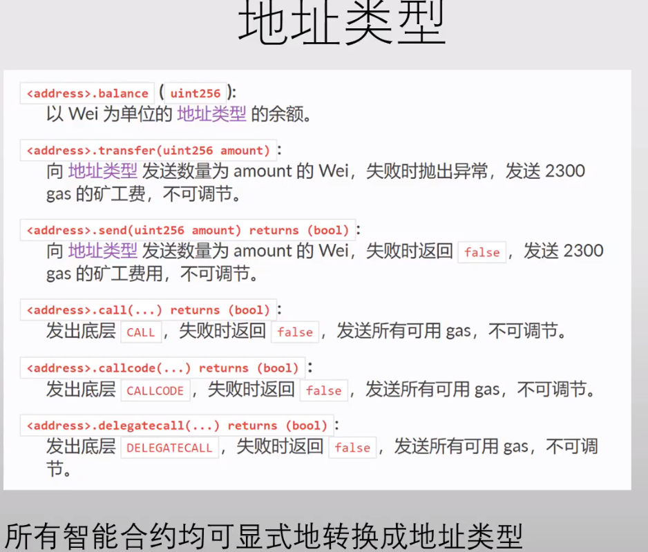

address.call() - 当前合约调用 address 这个合约。

transfer 是连锁性质回滚 ； send 不会连锁回滚

---

### 简单拍卖

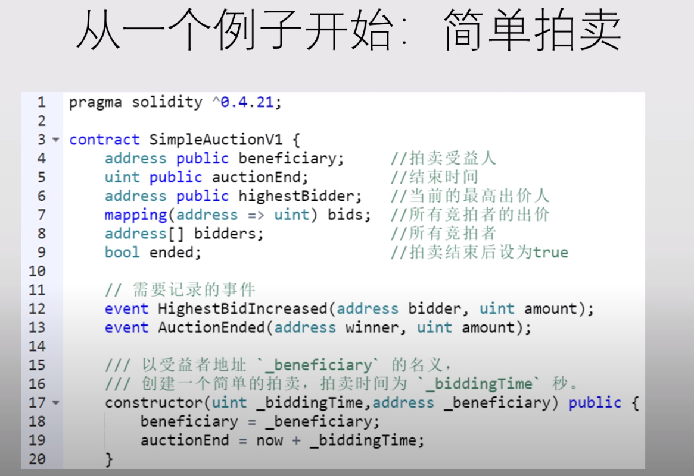

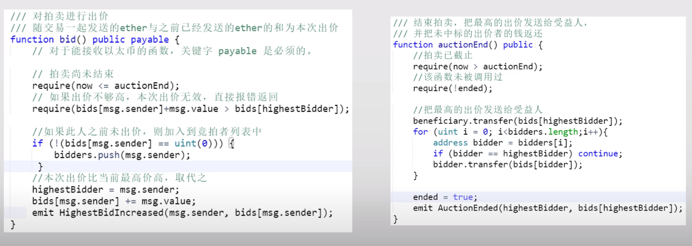

先写一个智能合约代码，然后发布上去

（如何发布 - 向地址0转账0代码放在data域上面，交汽油费，返回一个区块链上面的地址

智能合约账户里面有状态。

外部账户要拍卖，调用 bid 函数，需要矿工写进区块链里面。

**智能合约是有问题的**

区块链是不可篡改的 - 不能有 BUG

【AuctionEnd】必须要有人调用才能执行（没有办法设置成自动调用）

不用担心并发执行（没有多线程）矿工一个接一个交易去执行。

hacker 调用一个 hacker_contract 来进行投标：

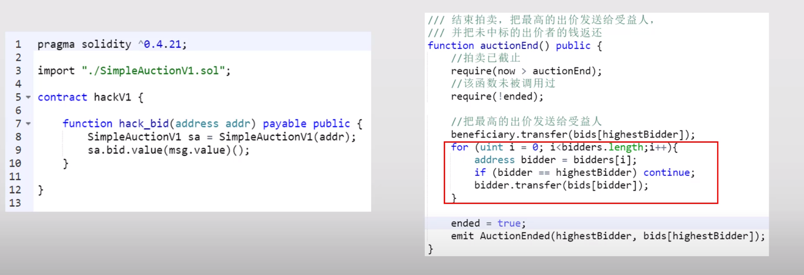

支付的时候没啥问题

- 退款的时候没有调用任何函数，默认调用 fallback 函数

- 没有定义 fallback 函数，报错，连锁式回滚

所有的智能合约中的修改都是在改本地的数据结构；

整个都回滚了，就像是从来没有执行过 - 没有任何人能收到钱（钱都锁在了智能合约里面

> Code is Law.

可不可以在智能合约里面留一个后门 ？

系统管理员有可能卷款跑路，同时也是和去中心化的理念背道而驰的。

**拆分函数**

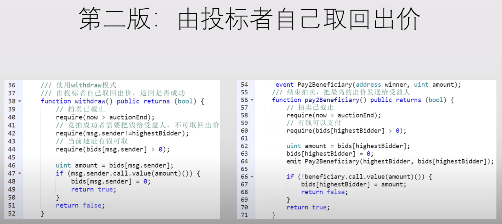

没有使用循环，直接自己进行调用。

**重入攻击**

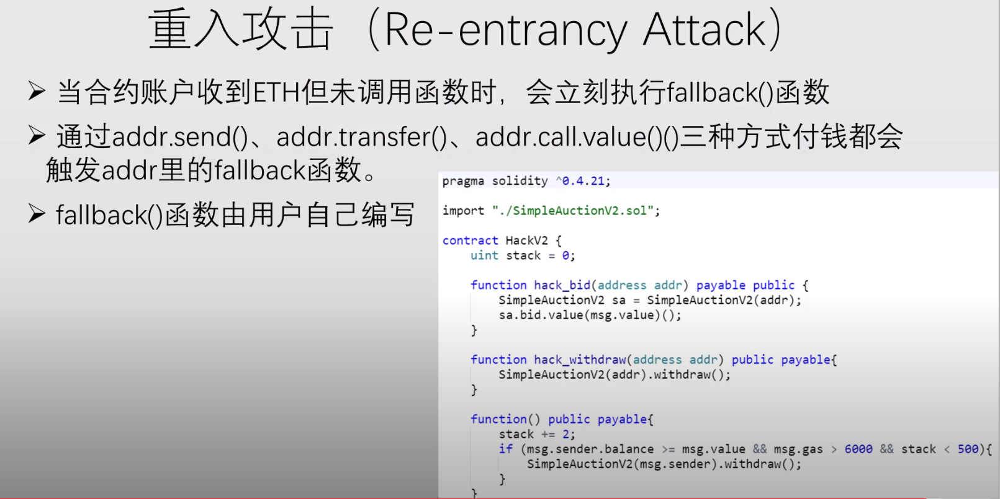

黑客的攻击 fallback 里面互相调用，不停地从拍卖合约中取钱。

递归重复取钱到什么时候结束：

- 账户上钱不够了
- 汽油费不够了
- 递归栈调用溢出了、

最简单的思想就是先清零，然后再转账

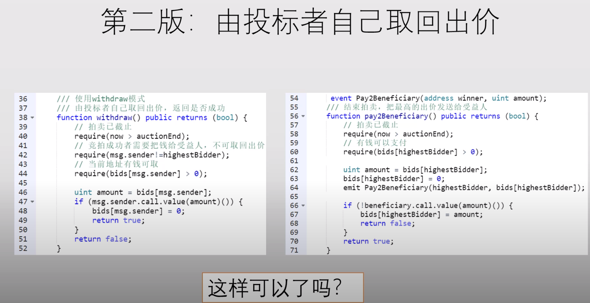

**先判断条件，改变条件，然后和其他交互**

另一种方式，不要使用 call.value 来转账，使用 send / transfer

因为转账过去的汽油费只是 2300 个单位，只够产生写一个 log，不够产生新的调用。

​	