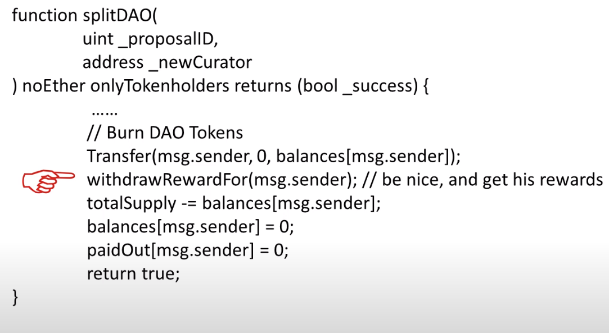
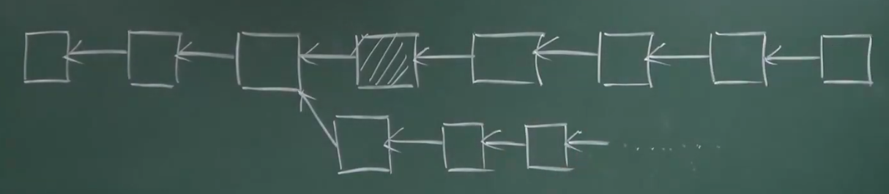

# 23-ETH-TheDAO

比特币-去中心化的货币

以太坊-去中心化的合约

---

### DAO: Decentralized Autonomous Organization

组织的规章制度通过代码写在区块链里面的。

**DAC** Corporation - 盈利

**The DAO** 区块链众筹 - 代币

**split DAO** 拆分出来成立 **child DAO** - 尊重少数人的权利

- 7天 讨论期
- 28天 锁定期

**重入攻击** - 先转走然后设置为0

两派不同的观点：

- 回滚
- 不回滚 - 只是一个普通的智能合约，影响了以太坊的不可逆转性

### 补救

不能这样 - 影响其他人正常的交易

**两步走**

- 锁定黑客的账户 - 软件升级：TheDAO 不允许交易 - **软分叉**（旧矿工认可新区块）
- 清退钱 - **硬分叉**

**汽油费** - 不执行和 TheDAO 相关的交易，汽油费要不要收~ 

没有收汽油费，然后就有很多的无效的攻击。

**硬分叉** - 转到一个新的智能合约上，只有一个功能就是退钱。

软件升级，强行进行转账（旧矿工不会认可新挖出来的区块 - 硬分叉）

竞争激烈，使用了一个 投票的智能合约 来进行决定是否要分叉。

---

硬分叉之后，还有一些矿工还在旧链上面继续挖。

ETH / ETC（Ethereum Classic）

重放攻击（在旧链上面能够执行）

增加了一个 ChainID ， 现在就完全分开啦。

### 为什么不能只针对黑客的账户？

如果你的智能合约是有 BUG 的，所有人都可以看。

所有人都可以偷这个以太坊中的币（任何人都是黑客）